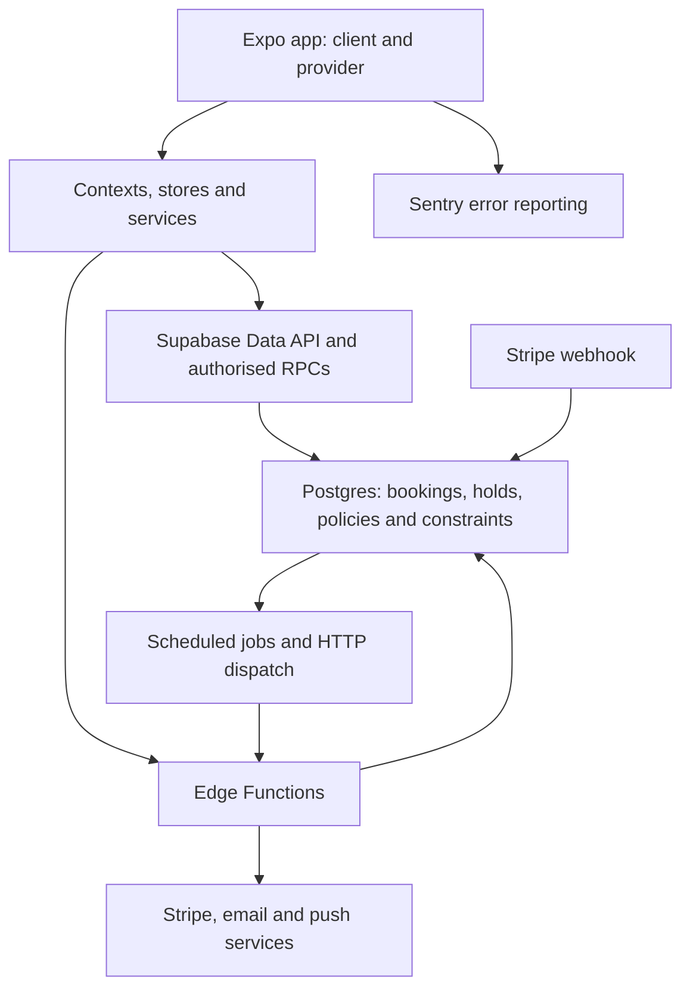

# CERVICED architecture and reliability audit

Audit date: 29 September 2026 UTC. Repository HEAD: `5f90cdb`, with substantial pre-existing uncommitted changes. Findings describe the working tree and live project as observed, not a clean release commit.

## Decision

Keep Expo/React Native and Supabase Postgres. No evidence collected justifies a second database, Redis, microservices or Kubernetes. Prioritise payment recovery, privileged function access, reproducible deployments and measurement. Current production data is too small to establish large-scale capacity.

This pass inspected source, queried live database metadata/statistics, read deployed payment function source, ran Supabase advisors and executed local quality checks. It made no production changes and invoked no payment, booking, email or payout actions. It is not a penetration test or a completed device/load test.

## Verification results

| Check | Observed result |
|---|---|
| Jest | 101 suites, 718 tests passed; 19.293 seconds reported by Jest |
| TypeScript | Failed: TS2367 in `src/screens/shared/NotificationsScreen.tsx:680`, incompatible narrowed notification-type comparison |
| ESLint | Failed: 474 errors, 46 warnings; includes React hook/ref rules. These are not 474 proven runtime defects |
| Migration inventory | Failed: all 23 required source files exist, but only 12 are represented by the manifest check in the canonical migration chain |
| Live overlap protection | `bookings_no_overlap` exclusion constraint exists, using provider ID and effective timestamp ranges |
| Scheduled jobs | 28 listed jobs active; no recorded failed runs in the preceding 24 hours. This does not prove downstream HTTP/email/payment delivery |
| End-to-end screen timings | Not measured: no instrumented release-build phone session was run |
| Restore exercise / load test | Not performed; no isolated staging target established during this pass |

Local check logs: `/private/tmp/cerviced-architecture-jest.log` and `/private/tmp/cerviced-architecture-lint.log` (temporary, not durable release evidence). Quality workflow: `.github/workflows/quality.yml`. Existing tests are valuable but do not prove live payment interruption or concurrent booking behaviour. `src/tests/performance.test.ts` tests utility behaviour, not screen latency.

## Architecture observed

Strengths worth preserving:

- Booking authority lives in database functions and constraints; the live overlap constraint protects concurrent provider reservations, beyond a UI availability check.
- Provider profile loading separates the first preview from the full catalogue and secondary sections (`src/features/providers/useProviderProfileData.ts`).
- Provider queries have row caps; profile nested collections are bounded; search ID lookups run in parallel (`src/services/databaseService.ts`).
- Image cache limits exist in `App.tsx`, and bounded TTL caching has tests.
- Booking confirmation retry and cart/waitlist expiry jobs exist and are running.
- Becca has a 3.5-second interpreter fallback in `src/services/becca/engine.ts`; normal browsing and booking do not depend on that AI request.
- The deployed Stripe webhook verifies signatures using the raw request body. The payout function uses a Stripe idempotency key. Neither fact by itself proves complete payment recovery.

## Prioritised findings and acceptance criteria

### A01 — P0: payment finalisation can commit before capture succeeds

**Confirmed code path, not an induced production incident.** Deployed `finalize-payment-intent` v12 and local `supabase/functions/finalize-payment-intent/index.ts:89–98` call `finalize_checkout` before Stripe capture. The live RPC converts holds into pending/confirmed bookings, inserts notifications and marks the batch `finalised`. If capture fails or the worker stops after the database commit, the retry rejects the now-finalised batch. A lost successful response also cannot return the already-completed result through this path.

Deployed `stripe-webhook` v2 handles account and transfer events, but not PaymentIntent success/failure reconciliation. It therefore does not close this failure window. No card was charged to demonstrate the scenario.

**Action:** define recoverable payment states and a reconciliation worker/webhook; make retries return the existing result; distinguish authorised, captured and failed payments. Do not merely reverse the database/Stripe order, which creates the opposite failure window.

**Done when:** Stripe test-mode fault injection covers process termination and lost responses before/after database finalisation and capture. Every outcome converges to a correct booking/payment state, with no duplicate charge and no unpaid booking represented as paid. Check payout eligibility against captured payment state as part of the same lifecycle review.

### A02 — P0: PaymentIntent creation is not concurrency-safe

**Confirmed in deployed `create-payment-intent` v12 and local source, lines 82–108.** Intent creation has no idempotency key. Binding uses an update conditioned on `payment_intent_id IS NULL`, but checks only `error`, not the number of updated rows. Two requests can both create an intent; the losing update can affect zero rows without an error, yet still return its intent's client secret. Later finalisation rejects that unbound intent. An ordinary retry after successful creation receives 409 rather than resuming the existing intent.

**Action:** use a stable checkout-scoped Stripe idempotency key, explicitly check binding success, and safely retrieve/resume the existing authorised intent.

**Done when:** two simultaneous create requests and response-loss retries resolve to one canonical intent and one booking outcome in an isolated test environment.

### A03 — P0: anonymous users can execute the payout-dispatch helper

**Live catalog and function body confirmed.** `public.process_due_payouts()` is SECURITY DEFINER, returns boolean and grants EXECUTE to `anon`. It reads the server credential internally and dispatches `release-payouts` when due rows exist, without checking caller authority. It does not return the credential or let the caller choose an arbitrary payout. Nevertheless, an unauthenticated caller can trigger privileged work outside the intended cron-only boundary.

**Action:** restrict execute privileges to intended internal roles, retaining the scheduled job's access. Review PUBLIC inheritance as well as explicit role grants.

**Done when:** anonymous and ordinary authenticated callers cannot invoke the helper, while the intended scheduler still can. Test denial without sending payments.

Do not treat all advisor warnings as equivalent exploits: of 13 anonymous SECURITY DEFINER warnings, 11 functions return `trigger`, and the remaining `get_provider_busy_spans` intentionally exposes redacted public availability with provider visibility checks. Trigger functions cannot simply be called as normal SQL RPCs.

### A04 — P1: this checkout does not reproduce production

The migration inventory reports 11 required changes absent from its canonical-chain mapping. Its filename mapping is not a semantic replay, so this is a rebuild blocker requiring investigation, not proof that production lacks those changes.

Live function inventory also contains `stripe-webhook`, `create-connect-account`, `release-payouts` and `refund-payment` with no matching directories under this checkout's `supabase/functions/`. Read deployed code before any redeployment. Another branch/worktree may own those sources; reconcile ownership first.

**Action:** recover the reviewed live baseline and migration history, reconcile remote-only functions, then build an isolated environment from the canonical sources. Do not replay legacy SQL over production.

**Done when:** a fresh staging environment reproduces required objects, grants, triggers, cron schedules and function versions, and the critical-contract checks pass. Extend CI to check migration integrity and Deno functions; current ESLint explicitly excludes Edge Functions.

### A05 — P1: release quality checks are currently failing

The current working tree fails TypeScript and lint despite passing Jest. The workflow runs typecheck before lint/tests, so a matching CI run would stop at typecheck.

**Action:** resolve the notification routing narrowing error and triage hook/ref lint findings by real correctness impact. Review dependency/config changes against the baseline before broad rewrites. Preserve other in-progress edits.

**Done when:** typecheck, lint and tests pass on a named clean release commit. Do not suppress the entire rule set to obtain a green build.

### A06 — P1: screen performance cannot currently be established from telemetry

`App.tsx:92` sets `tracesSampleRate: 0`; Sentry captures errors, not performance traces. Production in `eas.json:40` sets `SENTRY_DISABLE_AUTO_UPLOAD=true`, so the configured automatic source-map upload path is disabled. A separate upload mechanism was not verified. Non-development builds are labelled production in the Sentry setup, which can mix preview and production events.

**Action:** add privacy-conscious timing spans for startup, Home, Search, profile, availability and checkout; verify release/environment tagging, source maps and alert delivery. Record durations/statuses without names, addresses, health notes or payment details.

**Done when:** a release-build test event resolves to the correct source line and environment, and the five journeys below have measured network/render breakdowns on real devices.

### A07 — P1: appointment time rules need an explicit timezone contract

The live database timezone is UTC, no timezone-named provider column was found, and `enforce_booking_bookability` compares appointment dates/times with `CURRENT_DATE`, `LOCALTIME` and `now()`. The app has local-date helpers. If appointment times represent UK wall-clock time, UTC comparisons can apply notice/past-time rules incorrectly during British Summer Time. This risk follows from the code; an end-to-end DST reproduction remains outstanding.

**Action:** establish the stored-time contract and use an explicit IANA business timezone for scheduling comparisons, converting appointment instants consistently.

**Done when:** tests cover Europe/London summer/winter offsets, clock-change ambiguous/missing times, midnight and a client travelling in another timezone.

### A08 — P2: search scalability and failure visibility

`searchProviders` in `src/services/databaseService.ts:834` does multiple substring `ILIKE '%term%'` lookups, limits each candidate list before deduplicating/filtering, then fetches providers. It defaults to a cap of 200 and does not expose continuation here. Intermediate lookup responses destructure `data` without checking `error`; failed lookups can appear as empty/partial results. Limits can also underfill results when many matching services belong to one provider.

**Action:** surface lookup failures first. Benchmark a server-side ranked, paginated search query on representative data; consider Postgres full-text/trigram indexes based on actual query plans before buying external search.

**Done when:** search distinguishes failure from no matches, pagination has stable ordering, and seeded multi-provider/multi-service cases return the expected results within the agreed latency budget.

### A09 — P2: database policy/index optimisation needs measurement

Live performance advisors reported 24 unindexed foreign keys, 80 auth/RLS initialisation warnings, 403 multiple-permissive-policy findings, 26 unused indexes and one duplicate-index finding. These counts are findings, not unique slow tables: role/action combinations repeat. Small tables can legitimately use sequential scans, and unused indexes should not be dropped just because test traffic has not exercised them.

The duplicate pair is on `provider_blocked_dates`: `provider_blocked_dates_provider_date_unique` and `provider_blocked_dates_provider_id_blocked_date_key`. Check constraint dependencies before removing anything.

**Action:** prioritise policies/indexes involved in measured slow authenticated queries; preserve the exact access model when consolidating policies. Compare EXPLAIN plans using realistic data and application roles.

**Done when:** documented query plans and before/after timings demonstrate improvements with unchanged authorisation tests.

### A10 — P1: prove recovery and downstream delivery

Cron history is healthy at the SQL-job level. Email retry exists and push source polls delivery receipts, but these are not proof of end-to-end delivery, alerting or successful disaster recovery. Backup configuration, storage-file recovery, external uptime alerts and a completed restore drill were not verified during this pass.

**Action:** document recovery-time/data-loss targets, verify database and uploaded-file backups, restore into an isolated environment, and alert on missed jobs, delivery failures and unreconciled payments. Persist failed work for review/retry; adopt Supabase Queues only where the existing mechanism lacks the required durability.

**Done when:** a recorded restore succeeds, a deliberately failed test notification reaches an operator alert, and stuck work can be safely replayed without duplicate business actions.

## What the current measurements mean

Live table estimates included about 112 bookings, 53 services, 119 portfolio items and 1,062 notifications. These are `pg_stat_user_tables` estimates, not exact counts or scale tests.

The highest cumulative-time statements inspected were scheduled jobs: `expire_waitlist_holds` averaged 50.81 ms across about 50,548 calls; `expire_cart_holds` averaged 68.74 ms across 16,412 calls. The highest observed execution for these was about 1.39 seconds. Statistics are cumulative over an unverified reset window; they are neither current p95s nor screen timings. Migration/admin statements also occur in the statistics, so unfiltered “slowest query” rankings would be misleading.

There is no defensible current measurement of Home/Search/profile/availability/checkout p95, frame rate, cold-start time or maximum concurrent-user capacity from this audit.

## Device and staging measurement plan

Extend the existing `PERF-001` item in `beta-readiness-tickets.md` rather than creating a competing performance queue.

| Journey | Capture | Initial target to validate, not an observed result |
|---|---|---|
| Startup/Home | Launch to usable content; auth, fonts, requests, images, renders | p95 usable content within 2 seconds on an agreed reference device/network |
| Search | Last input to results; separate the current 400 ms debounce from backend/network time | p95 within 1 second including debounce |
| Provider profile | Hero first paint and full catalogue ready separately | p95 hero within 1 second from tap |
| Availability | Date tap to usable slots, request count and stale-cache invalidation | p95 within 1 second |
| Checkout | Server preparation, authorisation and finalisation separately | p95 own-backend stages within 2 seconds; exclude user/bank interaction |

Use release builds on one representative iPhone and mid-range Android phone; record build ID, OS, network conditions, warm/cold cache and sample count. Run at least 30 samples per case for an initial baseline, and gather larger production samples before treating tail percentiles as stable. Test weak connectivity and reconnection separately.

In staging, seed realistic provider/service/image volumes and test a declared concurrency ramp. Test two clients racing for one slot, a multi-item cart, abandoned holds, reschedule races, duplicate payment requests and worker interruption. Set stop thresholds and measure database CPU, connections, latency, error rate and backlog age. No load test should run against the live booking project as part of this audit.

## Implementation order and service decisions

1. Restrict payout helper access; restore ownership of deployed payment sources.
2. Fix and fault-test payment creation/finalisation recovery before real-money launch.
3. Rebuild staging from canonical migrations/functions and get release checks green.
4. Verify timezone semantics, monitoring, source maps, alerts and recovery.
5. Measure the five journeys; fix the largest measured delays and search failure handling.
6. Optimise database policies/indexes against representative traffic, then size compute from evidence.

Keep Supabase, Stripe, existing email/push services and Sentry. Verify their configuration before adding replacements. An external uptime check is useful if absent. A durable queue may be useful where jobs are not recoverable. Redis, a dedicated search service and a second database remain conditional on measured needs, not launch prerequisites.

## Official reference material

- [Supabase anonymous privileged-function advisory](https://supabase.com/docs/guides/database/database-linter?lint=0028_anon_security_definer_function_executable)
- [Supabase function search-path advisory](https://supabase.com/docs/guides/database/database-linter?lint=0011_function_search_path_mutable): six live warnings, including `decline_waitlist_hold` and five automation functions; inspect and pin appropriate paths.
- [Supabase RLS performance](https://supabase.com/docs/guides/database/postgres/row-level-security#call-functions-with-select)
- [Supabase duplicate-index advisory](https://supabase.com/docs/guides/database/database-linter?lint=0009_duplicate_index)
- [Supabase query optimisation](https://supabase.com/docs/guides/database/query-optimization)
- [Supabase backups](https://supabase.com/docs/guides/platform/backups): database backups do not include Storage file objects.
- [Stripe webhooks](https://docs.stripe.com/webhooks)
- [Expo monitoring](https://docs.expo.dev/monitoring/services/)

Other security advisor results to triage: four tables with RLS and no policies (may intentionally deny client access), two extensions in public, 75 authenticated SECURITY DEFINER execution warnings (many are legitimate authorised RPCs), and disabled leaked-password protection. These are review inputs, not automatically confirmed vulnerabilities.
