# Navigation Graph (generated)

> [!warning] Auto-generated by `scripts/gen-vault.mjs` — **do not edit by hand**.
> Run `npm run vault` (or just commit — the git hook refreshes it). Parsed from `navigation.navigate/push/replace('…')` calls across `src/screens`.

#generated

**81 edges** across **23 screens**. Curated overview: [[Screens & Navigation]].

## Diagram
> Dense is normal — pan/zoom, or read the list below.

```mermaid
graph LR
  AuthScreen --> Home
  BeautyBillingScreen --> BeautyProfile
  BeautyBillingScreen --> PaymentMethods
  BeautyBillingScreen --> Subscription
  BeccaScreen --> Bookings
  BeccaScreen --> Explore
  BeccaScreen --> ProviderProfile
  BookingsScreen --> Cart
  BookingsScreen --> ClientIntakeForm
  BookingsScreen --> DevSettings
  BookingsScreen --> ProviderChat
  BookingsScreen --> ProviderProfile
  BookmarkedProvidersScreen --> ProviderProfile
  BusinessProfileScreen --> Automations
  BusinessProfileScreen --> Branding
  BusinessProfileScreen --> BusinessDetails
  BusinessProfileScreen --> Communications
  BusinessProfileScreen --> EditProfile
  CartScreen --> Bookings
  CartScreen --> Home
  CartScreen --> ProviderProfile
  EventDetailScreen --> ProviderProfile
  ExploreScreen --> BookmarkedProviders
  ExploreScreen --> EventDetail
  ExploreScreen --> ProviderProfile
  HomeScreen --> Bookings
  HomeScreen --> BookmarkedProviders
  HomeScreen --> Notifications
  HomeScreen --> Offers
  HomeScreen --> ProviderProfile
  HomeScreen --> Search
  MessagesScreen --> ProviderChat
  ProviderAccountScreen --> About
  ProviderAccountScreen --> AccountInfo
  ProviderAccountScreen --> Analytics
  ProviderAccountScreen --> BookingHistory
  ProviderAccountScreen --> BusinessProfile
  ProviderAccountScreen --> ChangePassword
  ProviderAccountScreen --> Clientele
  ProviderAccountScreen --> HelpCentre
  ProviderAccountScreen --> Notifications
  ProviderAccountScreen --> Promotions
  ProviderAccountScreen --> ReportProblem
  ProviderAccountScreen --> SignUpStep1
  ProviderAccountScreen --> SignUpStep2
  ProviderAccountScreen --> Terms
  ProviderAnalyticsScreen --> BookingDetail
  ProviderAnalyticsScreen --> BookingHistory
  ProviderBookingDetailScreen --> ProviderConversation
  ProviderBookingDetailScreen --> ProviderIntakeForm
  ProviderBookingHistoryScreen --> BookingDetail
  ProviderBookingHistoryScreen --> DevSettings
  ProviderCommunicationsScreen --> BusinessEmail
  ProviderHomeScreen --> BookingDetail
  ProviderHomeScreen --> Notifications
  ProviderHomeScreen --> Profile
  ProviderHomeScreen --> ProviderConversation
  ProviderHomeScreen --> ProviderSchedule
  ProviderInboxScreen --> BookingDetail
  ProviderInboxScreen --> ProviderConversation
  ProviderMyProfileScreen --> EditProfile
  ProviderProfileScreen --> Cart
  ProviderProfileScreen --> CartMain
  ProviderProfileScreen --> ProviderChat
  ProviderPromotionsScreen --> Clientele
  SearchScreen --> ProviderProfile
  UserProfileScreen --> About
  UserProfileScreen --> BeautyProfile
  UserProfileScreen --> Bookings
  UserProfileScreen --> BookmarkedProviders
  UserProfileScreen --> ChangePassword
  UserProfileScreen --> HelpCentre
  UserProfileScreen --> Messages
  UserProfileScreen --> NotificationsSettings
  UserProfileScreen --> PaymentMethods
  UserProfileScreen --> Points
  UserProfileScreen --> ProfileInfo
  UserProfileScreen --> ReportProblem
  UserProfileScreen --> SignUpStep3
  UserProfileScreen --> Subscription
  UserProfileScreen --> Terms
```

## By screen
- `AuthScreen` → `Home`
- `BeautyBillingScreen` → `BeautyProfile`, `PaymentMethods`, `Subscription`
- `BeccaScreen` → `Bookings`, `Explore`, `ProviderProfile`
- `BookingsScreen` → `Cart`, `ClientIntakeForm`, `DevSettings`, `ProviderChat`, `ProviderProfile`
- `BookmarkedProvidersScreen` → `ProviderProfile`
- `BusinessProfileScreen` → `Automations`, `Branding`, `BusinessDetails`, `Communications`, `EditProfile`
- `CartScreen` → `Bookings`, `Home`, `ProviderProfile`
- `EventDetailScreen` → `ProviderProfile`
- `ExploreScreen` → `BookmarkedProviders`, `EventDetail`, `ProviderProfile`
- `HomeScreen` → `Bookings`, `BookmarkedProviders`, `Notifications`, `Offers`, `ProviderProfile`, `Search`
- `MessagesScreen` → `ProviderChat`
- `ProviderAccountScreen` → `About`, `AccountInfo`, `Analytics`, `BookingHistory`, `BusinessProfile`, `ChangePassword`, `Clientele`, `HelpCentre`, `Notifications`, `Promotions`, `ReportProblem`, `SignUpStep1`, `SignUpStep2`, `Terms`
- `ProviderAnalyticsScreen` → `BookingDetail`, `BookingHistory`
- `ProviderBookingDetailScreen` → `ProviderConversation`, `ProviderIntakeForm`
- `ProviderBookingHistoryScreen` → `BookingDetail`, `DevSettings`
- `ProviderCommunicationsScreen` → `BusinessEmail`
- `ProviderHomeScreen` → `BookingDetail`, `Notifications`, `Profile`, `ProviderConversation`, `ProviderSchedule`
- `ProviderInboxScreen` → `BookingDetail`, `ProviderConversation`
- `ProviderMyProfileScreen` → `EditProfile`
- `ProviderProfileScreen` → `Cart`, `CartMain`, `ProviderChat`
- `ProviderPromotionsScreen` → `Clientele`
- `SearchScreen` → `ProviderProfile`
- `UserProfileScreen` → `About`, `BeautyProfile`, `Bookings`, `BookmarkedProviders`, `ChangePassword`, `HelpCentre`, `Messages`, `NotificationsSettings`, `PaymentMethods`, `Points`, `ProfileInfo`, `ReportProblem`, `SignUpStep3`, `Subscription`, `Terms`
