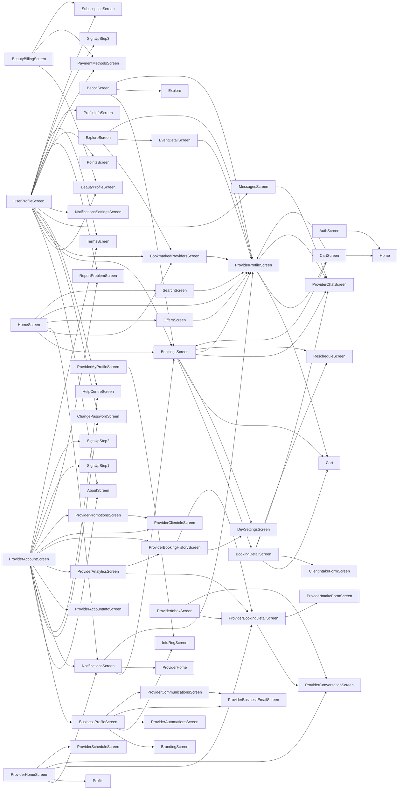

# Navigation Graph (generated)

> [!warning] Auto-generated by `scripts/gen-vault.mjs` — **do not edit by hand**.
> Run `npm run vault` (or just commit — the git hook refreshes it). Nav calls across `src/screens`, resolved route → screen component.

#generated

**90 edges** across **26 screens**. Node-graph version: [[Screen Flow (generated)]].

## Diagram
> Dense is normal — pan/zoom, or read the list below.

```mermaid
graph LR
  AuthScreen --> Home
  BeautyBillingScreen --> BeautyProfileScreen
  BeautyBillingScreen --> PaymentMethodsScreen
  BeautyBillingScreen --> SubscriptionScreen
  BeccaScreen --> BookingsScreen
  BeccaScreen --> Explore
  BeccaScreen --> ProviderProfileScreen
  BookingDetailScreen --> Cart
  BookingDetailScreen --> ClientIntakeFormScreen
  BookingDetailScreen --> ProviderChatScreen
  BookingDetailScreen --> RescheduleScreen
  BookingsScreen --> BookingDetailScreen
  BookingsScreen --> Cart
  BookingsScreen --> DevSettingsScreen
  BookingsScreen --> ProviderChatScreen
  BookingsScreen --> ProviderProfileScreen
  BookingsScreen --> RescheduleScreen
  BookmarkedProvidersScreen --> ProviderProfileScreen
  BusinessProfileScreen --> BrandingScreen
  BusinessProfileScreen --> InfoRegScreen
  BusinessProfileScreen --> ProviderAutomationsScreen
  BusinessProfileScreen --> ProviderBusinessEmailScreen
  BusinessProfileScreen --> ProviderCommunicationsScreen
  CartScreen --> BookingsScreen
  CartScreen --> Home
  CartScreen --> ProviderProfileScreen
  EventDetailScreen --> ProviderProfileScreen
  ExploreScreen --> BookmarkedProvidersScreen
  ExploreScreen --> EventDetailScreen
  ExploreScreen --> ProviderProfileScreen
  HomeScreen --> BookingsScreen
  HomeScreen --> BookmarkedProvidersScreen
  HomeScreen --> NotificationsScreen
  HomeScreen --> OffersScreen
  HomeScreen --> ProviderProfileScreen
  HomeScreen --> SearchScreen
  MessagesScreen --> ProviderChatScreen
  NotificationsScreen --> BookingsScreen
  NotificationsScreen --> ProviderHome
  NotificationsScreen --> ProviderProfileScreen
  OffersScreen --> ProviderProfileScreen
  ProviderAccountScreen --> AboutScreen
  ProviderAccountScreen --> BusinessProfileScreen
  ProviderAccountScreen --> ChangePasswordScreen
  ProviderAccountScreen --> HelpCentreScreen
  ProviderAccountScreen --> NotificationsScreen
  ProviderAccountScreen --> ProviderAccountInfoScreen
  ProviderAccountScreen --> ProviderAnalyticsScreen
  ProviderAccountScreen --> ProviderBookingHistoryScreen
  ProviderAccountScreen --> ProviderClienteleScreen
  ProviderAccountScreen --> ProviderPromotionsScreen
  ProviderAccountScreen --> ReportProblemScreen
  ProviderAccountScreen --> SignUpStep1
  ProviderAccountScreen --> SignUpStep2
  ProviderAccountScreen --> TermsScreen
  ProviderAnalyticsScreen --> ProviderBookingDetailScreen
  ProviderAnalyticsScreen --> ProviderBookingHistoryScreen
  ProviderBookingDetailScreen --> ProviderConversationScreen
  ProviderBookingDetailScreen --> ProviderIntakeFormScreen
  ProviderBookingHistoryScreen --> DevSettingsScreen
  ProviderBookingHistoryScreen --> ProviderBookingDetailScreen
  ProviderCommunicationsScreen --> ProviderBusinessEmailScreen
  ProviderHomeScreen --> NotificationsScreen
  ProviderHomeScreen --> Profile
  ProviderHomeScreen --> ProviderBookingDetailScreen
  ProviderHomeScreen --> ProviderConversationScreen
  ProviderHomeScreen --> ProviderScheduleScreen
  ProviderInboxScreen --> ProviderBookingDetailScreen
  ProviderInboxScreen --> ProviderConversationScreen
  ProviderMyProfileScreen --> InfoRegScreen
  ProviderProfileScreen --> Cart
  ProviderProfileScreen --> CartScreen
  ProviderProfileScreen --> ProviderChatScreen
  ProviderPromotionsScreen --> ProviderClienteleScreen
  SearchScreen --> ProviderProfileScreen
  UserProfileScreen --> AboutScreen
  UserProfileScreen --> BeautyProfileScreen
  UserProfileScreen --> BookingsScreen
  UserProfileScreen --> BookmarkedProvidersScreen
  UserProfileScreen --> ChangePasswordScreen
  UserProfileScreen --> HelpCentreScreen
  UserProfileScreen --> MessagesScreen
  UserProfileScreen --> NotificationsSettingsScreen
  UserProfileScreen --> PaymentMethodsScreen
  UserProfileScreen --> PointsScreen
  UserProfileScreen --> ProfileInfoScreen
  UserProfileScreen --> ReportProblemScreen
  UserProfileScreen --> SignUpStep3
  UserProfileScreen --> SubscriptionScreen
  UserProfileScreen --> TermsScreen
```

## By screen
- `AuthScreen` → `Home`
- `BeautyBillingScreen` → `BeautyProfileScreen`, `PaymentMethodsScreen`, `SubscriptionScreen`
- `BeccaScreen` → `BookingsScreen`, `Explore`, `ProviderProfileScreen`
- `BookingDetailScreen` → `Cart`, `ClientIntakeFormScreen`, `ProviderChatScreen`, `RescheduleScreen`
- `BookingsScreen` → `BookingDetailScreen`, `Cart`, `DevSettingsScreen`, `ProviderChatScreen`, `ProviderProfileScreen`, `RescheduleScreen`
- `BookmarkedProvidersScreen` → `ProviderProfileScreen`
- `BusinessProfileScreen` → `BrandingScreen`, `InfoRegScreen`, `ProviderAutomationsScreen`, `ProviderBusinessEmailScreen`, `ProviderCommunicationsScreen`
- `CartScreen` → `BookingsScreen`, `Home`, `ProviderProfileScreen`
- `EventDetailScreen` → `ProviderProfileScreen`
- `ExploreScreen` → `BookmarkedProvidersScreen`, `EventDetailScreen`, `ProviderProfileScreen`
- `HomeScreen` → `BookingsScreen`, `BookmarkedProvidersScreen`, `NotificationsScreen`, `OffersScreen`, `ProviderProfileScreen`, `SearchScreen`
- `MessagesScreen` → `ProviderChatScreen`
- `NotificationsScreen` → `BookingsScreen`, `ProviderHome`, `ProviderProfileScreen`
- `OffersScreen` → `ProviderProfileScreen`
- `ProviderAccountScreen` → `AboutScreen`, `BusinessProfileScreen`, `ChangePasswordScreen`, `HelpCentreScreen`, `NotificationsScreen`, `ProviderAccountInfoScreen`, `ProviderAnalyticsScreen`, `ProviderBookingHistoryScreen`, `ProviderClienteleScreen`, `ProviderPromotionsScreen`, `ReportProblemScreen`, `SignUpStep1`, `SignUpStep2`, `TermsScreen`
- `ProviderAnalyticsScreen` → `ProviderBookingDetailScreen`, `ProviderBookingHistoryScreen`
- `ProviderBookingDetailScreen` → `ProviderConversationScreen`, `ProviderIntakeFormScreen`
- `ProviderBookingHistoryScreen` → `DevSettingsScreen`, `ProviderBookingDetailScreen`
- `ProviderCommunicationsScreen` → `ProviderBusinessEmailScreen`
- `ProviderHomeScreen` → `NotificationsScreen`, `Profile`, `ProviderBookingDetailScreen`, `ProviderConversationScreen`, `ProviderScheduleScreen`
- `ProviderInboxScreen` → `ProviderBookingDetailScreen`, `ProviderConversationScreen`
- `ProviderMyProfileScreen` → `InfoRegScreen`
- `ProviderProfileScreen` → `Cart`, `CartScreen`, `ProviderChatScreen`
- `ProviderPromotionsScreen` → `ProviderClienteleScreen`
- `SearchScreen` → `ProviderProfileScreen`
- `UserProfileScreen` → `AboutScreen`, `BeautyProfileScreen`, `BookingsScreen`, `BookmarkedProvidersScreen`, `ChangePasswordScreen`, `HelpCentreScreen`, `MessagesScreen`, `NotificationsSettingsScreen`, `PaymentMethodsScreen`, `PointsScreen`, `ProfileInfoScreen`, `ReportProblemScreen`, `SignUpStep3`, `SubscriptionScreen`, `TermsScreen`
