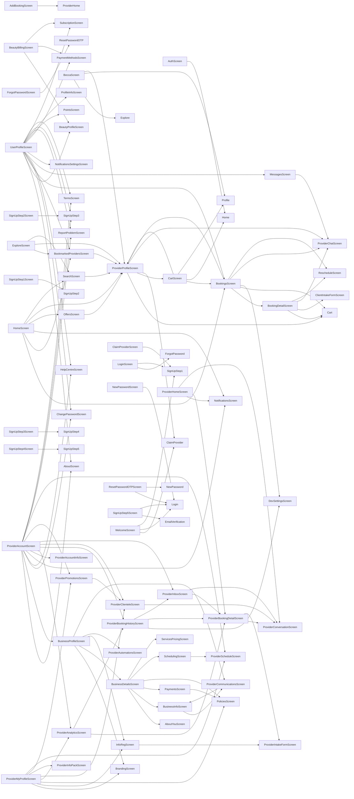

# Navigation Graph (generated)

> [!warning] Auto-generated by `scripts/gen-vault.mjs` — **do not edit by hand**.
> Run `npm run vault` (or just commit — the git hook refreshes it). Nav calls across `src/screens`, resolved route → screen component.

#generated

**123 edges** across **42 screens**. Node-graph version: [[Screen Flow (generated)]].

## Diagram
> Dense is normal — pan/zoom, or read the list below.

```mermaid
graph LR
  AddBookingScreen --> ProviderHome
  AuthScreen --> Home
  BeautyBillingScreen --> BeautyProfileScreen
  BeautyBillingScreen --> PaymentMethodsScreen
  BeautyBillingScreen --> SubscriptionScreen
  BeccaScreen --> Explore
  BeccaScreen --> Profile
  BeccaScreen --> ProviderProfileScreen
  BookingDetailScreen --> Cart
  BookingDetailScreen --> ClientIntakeFormScreen
  BookingDetailScreen --> ProviderChatScreen
  BookingDetailScreen --> RescheduleScreen
  BookingsScreen --> BookingDetailScreen
  BookingsScreen --> Cart
  BookingsScreen --> DevSettingsScreen
  BookingsScreen --> ProviderChatScreen
  BookingsScreen --> ProviderProfileScreen
  BookingsScreen --> RescheduleScreen
  BookmarkedProvidersScreen --> ProviderProfileScreen
  BusinessDetailsScreen --> AboutYouScreen
  BusinessDetailsScreen --> BusinessInfoScreen
  BusinessDetailsScreen --> PaymentsScreen
  BusinessDetailsScreen --> PoliciesScreen
  BusinessDetailsScreen --> SchedulingScreen
  BusinessDetailsScreen --> ServicesPricingScreen
  BusinessInfoScreen --> ProviderCommunicationsScreen
  BusinessProfileScreen --> BrandingScreen
  BusinessProfileScreen --> BusinessDetailsScreen
  BusinessProfileScreen --> InfoRegScreen
  BusinessProfileScreen --> ProviderAutomationsScreen
  BusinessProfileScreen --> ProviderCommunicationsScreen
  CartScreen --> BookingsScreen
  CartScreen --> Home
  CartScreen --> Profile
  CartScreen --> ProviderProfileScreen
  ClaimProviderScreen --> SignUpStep1
  ExploreScreen --> BookmarkedProvidersScreen
  ExploreScreen --> ProviderProfileScreen
  ExploreScreen --> SearchScreen
  ForgotPasswordScreen --> ResetPasswordOTP
  HomeScreen --> BookingsScreen
  HomeScreen --> BookmarkedProvidersScreen
  HomeScreen --> NotificationsScreen
  HomeScreen --> OffersScreen
  HomeScreen --> ProviderProfileScreen
  HomeScreen --> SearchScreen
  InfoRegScreen --> ProviderIntakeFormScreen
  LoginScreen --> ForgotPassword
  LoginScreen --> SignUpStep1
  MessagesScreen --> ProviderChatScreen
  NewPasswordScreen --> Login
  OffersScreen --> ProviderProfileScreen
  PaymentsScreen --> PoliciesScreen
  ProviderAccountScreen --> AboutScreen
  ProviderAccountScreen --> BusinessProfileScreen
  ProviderAccountScreen --> ChangePasswordScreen
  ProviderAccountScreen --> HelpCentreScreen
  ProviderAccountScreen --> NotificationsScreen
  ProviderAccountScreen --> ProviderAccountInfoScreen
  ProviderAccountScreen --> ProviderAnalyticsScreen
  ProviderAccountScreen --> ProviderBookingHistoryScreen
  ProviderAccountScreen --> ProviderClienteleScreen
  ProviderAccountScreen --> ProviderInboxScreen
  ProviderAccountScreen --> ProviderPromotionsScreen
  ProviderAccountScreen --> ProviderScheduleScreen
  ProviderAccountScreen --> ReportProblemScreen
  ProviderAccountScreen --> SignUpStep3
  ProviderAccountScreen --> TermsScreen
  ProviderAnalyticsScreen --> ProviderBookingDetailScreen
  ProviderAnalyticsScreen --> ProviderBookingHistoryScreen
  ProviderBookingDetailScreen --> ProviderConversationScreen
  ProviderBookingDetailScreen --> ProviderIntakeFormScreen
  ProviderBookingHistoryScreen --> DevSettingsScreen
  ProviderBookingHistoryScreen --> ProviderBookingDetailScreen
  ProviderBookingHistoryScreen --> ProviderInboxScreen
  ProviderClienteleScreen --> ProviderConversationScreen
  ProviderCommunicationsScreen --> BusinessInfoScreen
  ProviderHomeScreen --> NotificationsScreen
  ProviderHomeScreen --> ProviderBookingDetailScreen
  ProviderHomeScreen --> ProviderConversationScreen
  ProviderInboxScreen --> ProviderBookingDetailScreen
  ProviderInboxScreen --> ProviderConversationScreen
  ProviderMyProfileScreen --> BrandingScreen
  ProviderMyProfileScreen --> InfoRegScreen
  ProviderMyProfileScreen --> PoliciesScreen
  ProviderMyProfileScreen --> ProviderAnalyticsScreen
  ProviderMyProfileScreen --> ProviderClienteleScreen
  ProviderMyProfileScreen --> ProviderInfoPackScreen
  ProviderMyProfileScreen --> ProviderPromotionsScreen
  ProviderMyProfileScreen --> ProviderScheduleScreen
  ProviderProfileScreen --> Cart
  ProviderProfileScreen --> CartScreen
  ProviderProfileScreen --> ClaimProvider
  ProviderProfileScreen --> ProviderChatScreen
  ProviderPromotionsScreen --> ProviderClienteleScreen
  ResetPasswordOTPScreen --> Login
  ResetPasswordOTPScreen --> NewPassword
  SchedulingScreen --> ProviderScheduleScreen
  SearchScreen --> ProviderProfileScreen
  SignUpStep1Screen --> SignUpStep2
  SignUpStep2Screen --> SignUpStep3
  SignUpStep3Screen --> SignUpStep4
  SignUpStep4Screen --> SignUpStep5
  SignUpStep5Screen --> EmailVerification
  SignUpStep5Screen --> Login
  UserProfileScreen --> AboutScreen
  UserProfileScreen --> BeautyProfileScreen
  UserProfileScreen --> BookingsScreen
  UserProfileScreen --> BookmarkedProvidersScreen
  UserProfileScreen --> ChangePasswordScreen
  UserProfileScreen --> HelpCentreScreen
  UserProfileScreen --> MessagesScreen
  UserProfileScreen --> NotificationsSettingsScreen
  UserProfileScreen --> PaymentMethodsScreen
  UserProfileScreen --> PointsScreen
  UserProfileScreen --> ProfileInfoScreen
  UserProfileScreen --> ReportProblemScreen
  UserProfileScreen --> SignUpStep3
  UserProfileScreen --> SubscriptionScreen
  UserProfileScreen --> TermsScreen
  WelcomeScreen --> ClaimProvider
  WelcomeScreen --> Login
  WelcomeScreen --> SignUpStep1
```

## By screen
- `auth/AuthScreen` → `Home`
- `auth/ClaimProviderScreen` → `SignUpStep1`
- `auth/ForgotPasswordScreen` → `ResetPasswordOTP`
- `auth/LoginScreen` → `ForgotPassword`, `SignUpStep1`
- `auth/NewPasswordScreen` → `Login`
- `auth/ResetPasswordOTPScreen` → `Login`, `NewPassword`
- `auth/SignUpStep1Screen` → `SignUpStep2`
- `auth/SignUpStep2Screen` → `SignUpStep3`
- `auth/SignUpStep3Screen` → `SignUpStep4`
- `auth/SignUpStep4Screen` → `SignUpStep5`
- `auth/SignUpStep5Screen` → `EmailVerification`, `Login`
- `auth/WelcomeScreen` → `ClaimProvider`, `Login`, `SignUpStep1`
- `client/BeautyBillingScreen` → `client/BeautyProfileScreen`, `client/PaymentMethodsScreen`, `client/SubscriptionScreen`
- `client/BookingDetailScreen` → `Cart`, `client/ClientIntakeFormScreen`, `client/ProviderChatScreen`, `client/RescheduleScreen`
- `client/BookingsScreen` → `Cart`, `client/BookingDetailScreen`, `client/ProviderChatScreen`, `client/ProviderProfileScreen`, `client/RescheduleScreen`, `shared/DevSettingsScreen`
- `client/BookmarkedProvidersScreen` → `client/ProviderProfileScreen`
- `client/CartScreen` → `client/BookingsScreen`, `client/ProviderProfileScreen`, `Home`, `Profile`
- `client/ExploreScreen` → `client/BookmarkedProvidersScreen`, `client/ProviderProfileScreen`, `client/SearchScreen`
- `client/HomeScreen` → `client/BookingsScreen`, `client/BookmarkedProvidersScreen`, `client/OffersScreen`, `client/ProviderProfileScreen`, `client/SearchScreen`, `shared/NotificationsScreen`
- `client/MessagesScreen` → `client/ProviderChatScreen`
- `client/OffersScreen` → `client/ProviderProfileScreen`
- `client/ProviderProfileScreen` → `Cart`, `ClaimProvider`, `client/CartScreen`, `client/ProviderChatScreen`
- `client/SearchScreen` → `client/ProviderProfileScreen`
- `client/UserProfileScreen` → `client/BeautyProfileScreen`, `client/BookingsScreen`, `client/BookmarkedProvidersScreen`, `client/MessagesScreen`, `client/NotificationsSettingsScreen`, `client/PaymentMethodsScreen`, `client/PointsScreen`, `client/ProfileInfoScreen`, `client/SubscriptionScreen`, `shared/AboutScreen`, `shared/ChangePasswordScreen`, `shared/HelpCentreScreen`, `shared/ReportProblemScreen`, `shared/TermsScreen`, `SignUpStep3`
- `provider/AddBookingScreen` → `ProviderHome`
- `provider/BusinessDetailsScreen` → `provider/AboutYouScreen`, `provider/BusinessInfoScreen`, `provider/PaymentsScreen`, `provider/PoliciesScreen`, `provider/SchedulingScreen`, `provider/ServicesPricingScreen`
- `provider/BusinessInfoScreen` → `provider/ProviderCommunicationsScreen`
- `provider/BusinessProfileScreen` → `provider/BrandingScreen`, `provider/BusinessDetailsScreen`, `provider/InfoRegScreen`, `provider/ProviderAutomationsScreen`, `provider/ProviderCommunicationsScreen`
- `provider/InfoRegScreen` → `provider/ProviderIntakeFormScreen`
- `provider/PaymentsScreen` → `provider/PoliciesScreen`
- `provider/ProviderAccountScreen` → `provider/BusinessProfileScreen`, `provider/ProviderAccountInfoScreen`, `provider/ProviderAnalyticsScreen`, `provider/ProviderBookingHistoryScreen`, `provider/ProviderClienteleScreen`, `provider/ProviderInboxScreen`, `provider/ProviderPromotionsScreen`, `provider/ProviderScheduleScreen`, `shared/AboutScreen`, `shared/ChangePasswordScreen`, `shared/HelpCentreScreen`, `shared/NotificationsScreen`, `shared/ReportProblemScreen`, `shared/TermsScreen`, `SignUpStep3`
- `provider/ProviderAnalyticsScreen` → `provider/ProviderBookingDetailScreen`, `provider/ProviderBookingHistoryScreen`
- `provider/ProviderBookingDetailScreen` → `provider/ProviderConversationScreen`, `provider/ProviderIntakeFormScreen`
- `provider/ProviderBookingHistoryScreen` → `provider/ProviderBookingDetailScreen`, `provider/ProviderInboxScreen`, `shared/DevSettingsScreen`
- `provider/ProviderClienteleScreen` → `provider/ProviderConversationScreen`
- `provider/ProviderCommunicationsScreen` → `provider/BusinessInfoScreen`
- `provider/ProviderHomeScreen` → `provider/ProviderBookingDetailScreen`, `provider/ProviderConversationScreen`, `shared/NotificationsScreen`
- `provider/ProviderInboxScreen` → `provider/ProviderBookingDetailScreen`, `provider/ProviderConversationScreen`
- `provider/ProviderMyProfileScreen` → `provider/BrandingScreen`, `provider/InfoRegScreen`, `provider/PoliciesScreen`, `provider/ProviderAnalyticsScreen`, `provider/ProviderClienteleScreen`, `provider/ProviderInfoPackScreen`, `provider/ProviderPromotionsScreen`, `provider/ProviderScheduleScreen`
- `provider/ProviderPromotionsScreen` → `provider/ProviderClienteleScreen`
- `provider/SchedulingScreen` → `provider/ProviderScheduleScreen`
- `shared/BeccaScreen` → `client/ProviderProfileScreen`, `Explore`, `Profile`
